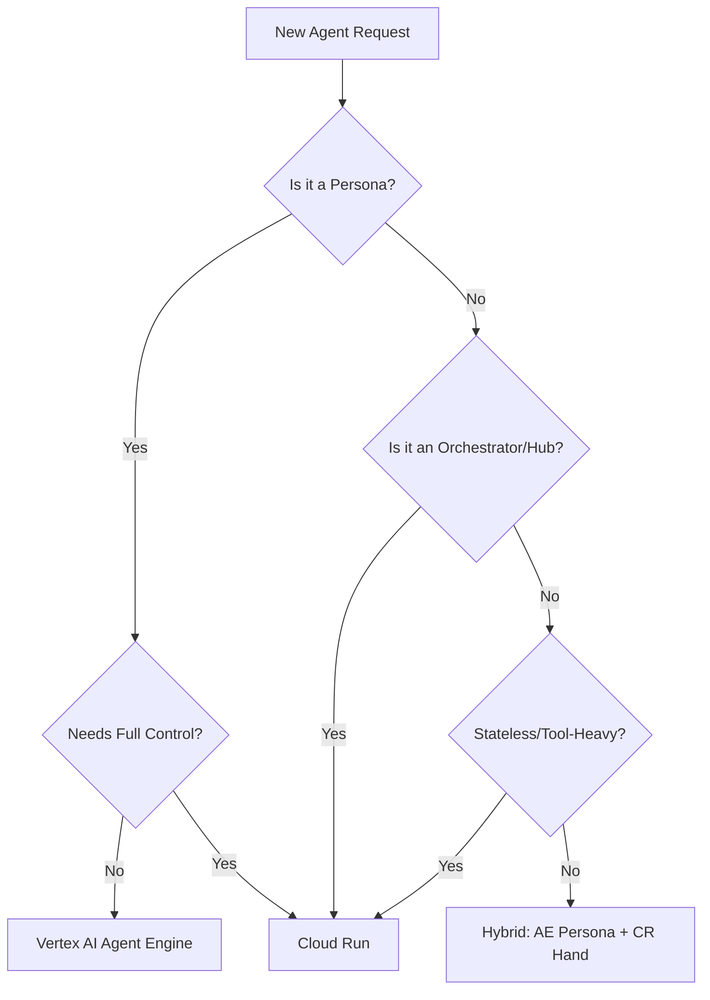

# GCP Agent Placement: Routing Rubric

Use this rubric to consistently steer ADK/A2A agent deployments to the correct platform.

## The Mental Model

| Deployment Target | Mental Model | Best For |
|---|---|---|
| **Cloud Run** | Agent = Your App | Custom systems, MCP hubs, production APIs, tool routers |
| **Vertex AI Agent Engine** | Agent = The Runtime | Long-lived conversational agents, person-facing personas |

## Decision Rubric

Score the agent request against these 6 signals:

1. **Statefulness**: Does it need built-in, managed conversation memory? (AE: Yes, CR: No/Custom)
2. **Conversational Continuity**: Is it "one continuous chat" over months? (AE: Yes, CR: No)
3. **Control Requirement**: Do you need to customize the runtime, MCP orchestration, or memory layer? (CR: Yes, AE: No)
4. **Tool-Heaviness**: Is the primary value executing tools and touching external systems? (CR: Yes, AE: No)
5. **Orchestration Role**: Is this agent a "brain" that coordinates other agents? (CR: Yes, AE: No)
6. **Persona vs Worker**: Is the agent a "character" with personality, or a "worker" with tools? (AE: Persona, CR: Worker)

## Decision Flow

## Anti-Patterns

- **DO NOT** put MCP routing inside Agent Engine.
- **DO NOT** put multi-agent orchestration brains inside Agent Engine.
- **DO NOT** attempt to "fake" long-term conversational memory on Cloud Run (unless using a custom graph DB).
- **DO NOT** deploy a simple "one-off" worker to Agent Engine.
